# Few Shot Learning using HRI

## Table of Contents

* Few Shot Learning Literature
  * General Setup and Datasets
  * Siamese and Triplet Networks
    * Cross Entropy Loss
    * Contrastive Loss
    * Triplet Loss
  * Matching Networks 
  * Meta-Agnostic Model Learning 
  * View-Manifold Learning
  * Prototypical Networks 
  * Activations to Parameters 
  * Weight Imprinting 
* Human Robot Interaction Setting 
  * Differences to Few Shot Literature 
  * KUKA Innovation Challenge 

Few Shot Learning, the ability to learn from few labeled samples, is a vital step in robot manipulation. In order for robots to operate in dynamic and unstructured environments, they need to learn novel objects on the fly from few samples. The current object recognition methods using convolutional networks are based on supervised learning with large-scale datasets such as ImageNet, with hundreds or thousands labeled examples. However, even with large-scale datasets they remain limited in multiple aspects, not all objects in our lives are within the 1000 labels provided in ImageNet. 

As humans we can hold the object and check it from different viewpoints and try to interact with it to learn more about the object. Thus the robot should be able to teach itself from the few samples for the different object viewpoints. If we are aiming as well at human centered artificial intelligence, a natural step is to teach robots about their environment through human robot interaction. A human teacher can show the object with different poses and verbally instruct the robot on what it is and how it can be used. A further step is combine that with the ability to learn from large-scale web data about that object.

 

# Few Shot Learning Literature
What motivated me to write on this topic was working on the KUKA innovation challenge, I was part of team Alberta that were in the 5 finalists. It turned out to be an exciting way of understanding the problem. While surveying and reading papers can give you the understanding of what the literature are working on. However, some new problems from working on the demo popped up that we realized are still lacking from the literature and my intention is to share these. 

## General Setup and Datasets
The few shot learning is formulated as a **m shot n way** classification problem, where **m is the number of labeled samples per class**, and **n is the number of classes** to classify among. Two main datasets are used in the literature:
* Omniglot Dataset [1], the few-shot version of MNIST. It is a character recognition dataset which contains 50 alphabets, each alphabet has around 15 to 40 characters, and each character is produced by 20 drawers. 
* Mini ImageNet dataset [2] on the other hand is a more realistic setting. 100 random classes from ImageNet are chose, with 80 for training and 20 for testing.  
* In a newer work in CVPR'18 [3] instead of evaluating on the few-shot set solely, evaluating on both few-shot set and the large-scale set data on the whole ImageNet data with the 1000-way accuracy was reported.

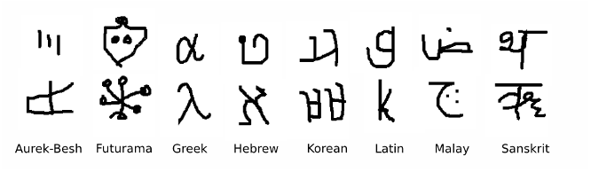 

## Siamese and Triplet Networks
Metric learning methods have the advantage that they rapidly learn novel concepts without retraining. 

### Cross Entropy Loss
One of the earliest attempts that was designed mainly for few shot learning using siamese networks was by Koch [6]. It formulated the few shot learning problem as a **verification task**. A siamese network consists of two twin networks with shared weights, and a weighted L1 distance function is learned. This is done by applying L1 distance on the output embeddings then adding one fully connected layer to learn the weighted distance. The loss function used in the paper is a regularized cross entropy, where the main aim is to drive similar samples to predict 1, and 0 otherwise.

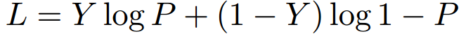 

### Contrastive Loss
One approach is to learn a mapping from inputs to vectors in an embedding space where the inputs of the same class are closer than those of different classes. Once the mapping is learned, at test time a nearest neighbors method can be used for classification for new classes that are unseen. A siamese network is trained with the output features fed to a Contrastive Loss [4]:

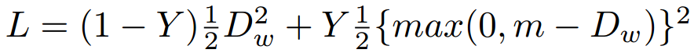 

Y label is 0 for similar class samples, 1 for dissimilar, and D is the euclidean distance. So the loss will decrease the distance D when the samples are from the same class, on the other hand when they are dissimilar it will try to increase D with a certain margin m. The margin purpose is to neglect samples that have larger distance than m, since we only want to focus on dissimilar samples that appear to be close.

### Triplet Loss
A better extension on the contrastive loss idea is to use a triplet network with triplet loss [5]. The triplet network inspiring from the siamese networks will have three copies of the network with shared weights. The input contains an anchor sample, a positive sample and a negative sample. The three output embeddings are then fed to the triplet loss [5]:

 
 

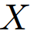 is the anchor sample,  is the positive sample,  is the negative sample, D is the distance function and m is the margin. The loss is decreasing the distance between the anchor and its positive sample while at the same time increasing its distance to the negative sample. 

### Summary
To sum it up there are three things to think of when desiging your method :

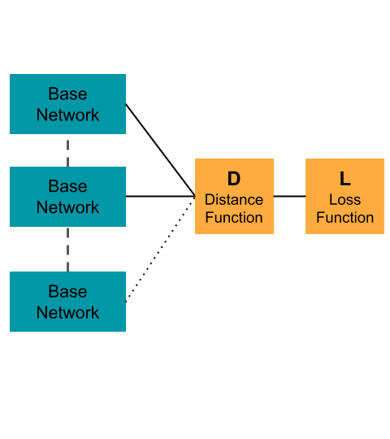 

* The base network architecture used in the siamese or triplet network.
* The distance function applied on the output embeddings:
  * L2 distance (Euclidean)
  * L1 distance
  * Weighted L1 distance
  * Cosine distance
* The loss function:
  * Contrastive Loss
  * Triplet Loss
  * Cross Entropy

[Other useful resources](https://hackernoon.com/one-shot-learning-with-siamese-networks-in-pytorch-8ddaab10340e).

## View-Manifold Learning

The previous approaches does not address the different viewpoints that can be available for the novel objects being learned. However in HRI setting you have the different viewpoints for the learned objects available. A very similar approach to the triplet network above but is specificaly designed to handle the learning of different views is [7]. They design a triplet network, with a cosine distance function between X1 and X2 vectors as:

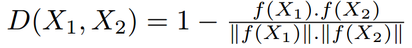 

A triplet loss similar to the above but with the cosine distance is used. Their experiments are done on 3D Models from ShapeNet dataset to incorporate different viewpoints for the learned objects. 

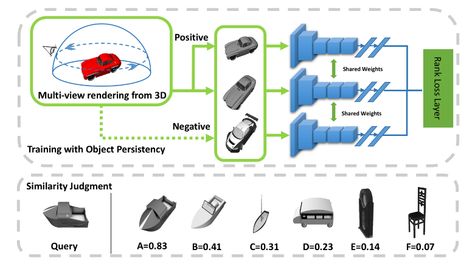 

## Matching Networks

On the same line of metric learning methods, matching networks tries to learn an end-to-end differentiable nearest neighbour [2]. It is based on this attention kernel:

 

Where the possible class labels  are weighted with , which determines how much two samples 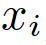,  are close. This  is computed as the softmax of the cosine distance between the two sample embeddings.

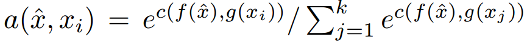 

f and g are the embeddings of both the test query and the training samples respectively. The training samples embedding is based on a bidirectional LSTM that learns the embedding in the support set context, where the support set is the set of few labeled samples. The test/query sample embedding f is based on LSTM with attention. 

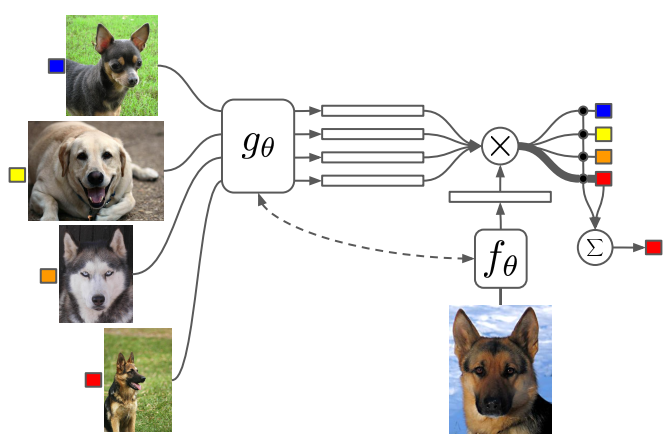 

[Other useful resouces](https://github.com/karpathy/paper-notes/blob/master/matching_networks.md).

## Prototypical Networks

Another work related to metric learning methods is prototypical networks [9]. It is based on the assumption that there exists an embedding in which points cluster around one prototype. The algorithm used for training is as follows:

 

After sampling the support and the query examples, the prototypes  are computed as the mean of the embeddings 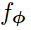 for the support set, i.e. the few labeled samples. 

Then the probability for a query point x to belong to class k is equal to the softmax over the distances to the prototypes:

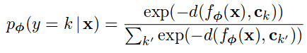 

The loss is computed then as the negative log likelihood as shown in the algorithm, where 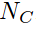  is the number of classes per episode ,   is the number of query examples.

## MAML

Another direction in few shot learning that is away from metric based learning methods is meta learning. MAML [8] creates a model agnostic method, that has a meta objective being optimized over all tasks. The algorithm from the paper:

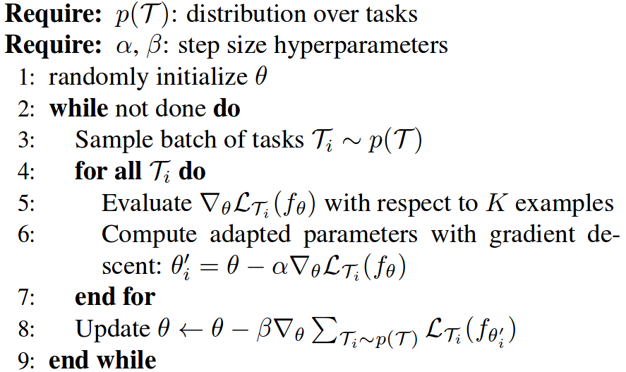 

For each sampled data points D it optimizes using stochastic gradient descent and updates the parameters based on . Then a meta update is computed that sums the gradients over all tasks, note that it is using the updated parameters . This is used to make a meta update to the parameters, and ensure that the model converges to a state where it is able to perform well on all tasks.

## Activations to Parameters

This year CVPR'18 had an interesting paper on few shot learning, it is showing promising results with a rather intuitive idea. The method is based on learning a mapping between activations and parameters/weights from large-scale data [3]. This mapping can be used when we have few labeled samples to get the corresponding weights of the classes from their activations.

 

The mapping between the activations and the parameters   is based on the activations statistic set, it acts as a category agnostic parameter predictor. The hope is that if it is trained on a large scale dataset , it will still generalize to the few labeled data . The statistic set in this case can be the mean of activations as in:

 

Where  is the mean of activations, in the few labeled samples especially in the one-shot setting it could end up using one labeled sample as the statistic set. This is definitely not a representative sample to the class, unlike what it has been trained on in the large scale (sufficient samples) data. So they suggest using sampling between the mean of activations or uniformly sampling from the examples itself as in:

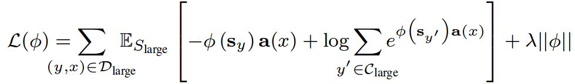 

Where 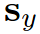 is sampled with a certain probability from the union set of both :
They were the first work to experiment on a 1000-way few shot recognition and report the performance on both large-scale and few labelled samples.

## Weights imprinting

Another interesting paper in CVPR'18 on few shot learning is the weight imprinting [10]. The work provides a connection between softmax classifier and metric learning methods. It is based on computing the weights for the new classes as the output activations, while old classes weights are kept the same, followed by normalization. The forward pass would then be computing the dot product between the embedding of the query example and the weights (templates) for each class (the imprinted weights). In case you have multiple examples per class, you would apply average on the embeddings to compute the imprinted weights of this class.

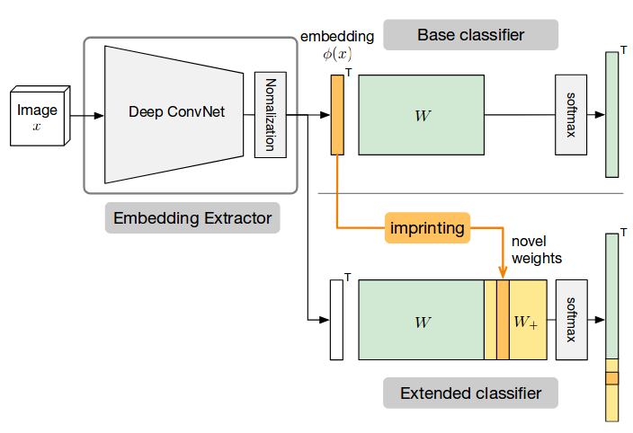 

***

# HRI Setting
## Differences to Few Shot Learning Literature

The fundamental differences between human robot interaction and the current few shot learning setting that we are thinking of: 
1. the abundance of **temporal information for the different poses of the object**. This has a little similarity to the work on View-Manifold learning, yet with a more realistic scenario containing illumination changes, occlusions and others.
2. the **hierarchy** of category, different instances/classes within the same category, and different poses. 
3. The **open set nature** of the problem, which requires the identification of unknown objects to the system. If the robot is able to identify what is unknown to it. It will be able to query for that object either on the large-scale web data or through interacting with the human as well. 
4. Different challenges introduced by the **cluttered background, the different rigid and non-rigid transformations, occlusions and illumination changes**. 
5. the **continual learning** of novel objects from **few labeled samples**.

## KUKA Innovation Challenge
So we basically worked with very simple methods for the KUKA innovation challenge to initially have a baseline to mainly provide continuous object detection from few labeled samples from the human teacher. While being able to perform open-set recognition and identify the unknown objects to the robot. The main goal was to get the robot to learn novel tools and their corresponding motions tasks online using human robot interaction.

<video class="center" src="kuka.mp4" width="640" height="480" controls preload></video>

Before the deadline I tried so much to take a video that would be perfect with no mistakes, but funny enough we ended up not using the video. We just had to make the demo work as much as we can and even if it had its failures, but it generally worked well and was able to continually learn objects that were from the audience there. It was a good start to understand the problem more anyway, and see how far we are from getting robots <3 to our homes :(.

***

# References

 [1] Lake, Brenden, et al. "One shot learning of simple visual concepts." Proceedings of the Annual Meeting of the Cognitive Science Society. Vol. 33. No. 33. 2011.

[2] Vinyals, Oriol, et al. "Matching networks for one shot learning." Advances in Neural Information Processing Systems. 2016.

[3] Qiao, Siyuan, et al. "Few-shot image recognition by predicting parameters from activations." CoRR, abs/1706.03466 1 (2017).

[4] Hadsell, Raia, Sumit Chopra, and Yann LeCun. "Dimensionality reduction by learning an invariant mapping." null. IEEE, 2006.

[5] Hoffer, Elad, and Nir Ailon. "Deep metric learning using triplet network." International Workshop on Similarity-Based Pattern Recognition. Springer, Cham, 2015.

[6] Koch, Gregory, Richard Zemel, and Ruslan Salakhutdinov. "Siamese neural networks for one-shot image recognition." ICML Deep Learning Workshop. Vol. 2. 2015.

[7] Lin, Xingyu, et al. "Transfer of view-manifold learning to similarity perception of novel objects." arXiv preprint arXiv:1704.00033 (2017).

[8] Finn, Chelsea, Pieter Abbeel, and Sergey Levine. "Model-agnostic meta-learning for fast adaptation of deep networks." arXiv preprint arXiv:1703.03400 (2017).

[9] Snell, Jake, Kevin Swersky, and Richard Zemel. "Prototypical networks for few-shot learning." Advances in Neural Information Processing Systems. 2017.

[10] Qi, Hang, Matthew Brown, and David G. Lowe. "Low-Shot Learning With Imprinted Weights." Proceedings of the IEEE Conference on Computer Vision and Pattern Recognition. 2018. 
